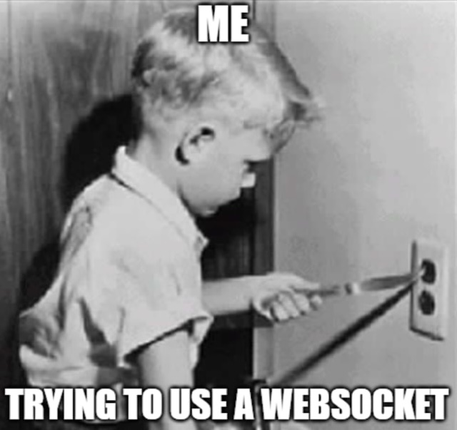
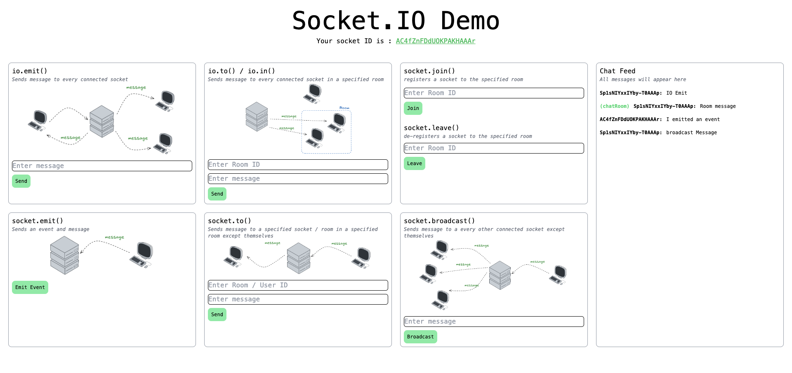

# Socket.IO Demo

Small app demonstrating all major socket.io API implementations.

    

## Screenshots

    

## Resources Used

1. [Socket.io](https://socket.io/)
2. [WebSockets in 100 Seconds & Beyond with Socket.io](https://youtu.be/1BfCnjr_Vjg)
3. [Learn Socket.IO for Real-time Chat App, private and group chat with Authentication and Middleware](https://youtu.be/_h7Pc1woq-I)
